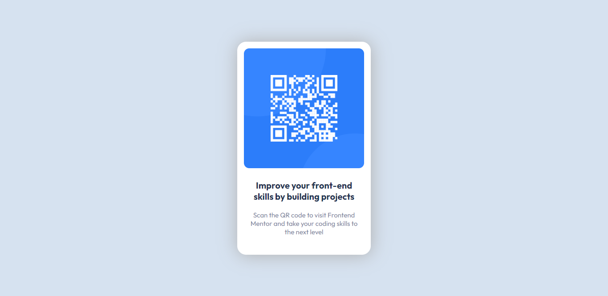

# Frontend Mentor - QR code component solution

This is a solution to the [QR code component challenge on Frontend Mentor](https://www.frontendmentor.io/challenges/qr-code-component-iux_sIO_H). Frontend Mentor challenges help you improve your coding skills by building realistic projects.

## Table of contents

- [Overview](#overview)
  - [Screenshot](#screenshot)
  - [Links](#links)
- [My process](#my-process)
  - [Built with](#built-with)
  - [What I learned](#what-i-learned)
  - [Continued development](#continued-development)
- [Author](#author)

## Overview

### Screenshot

### Links

- Solution URL: (https://github.com/7kingmad/qr-code-component-react)
- Live Site URL: [Add live site URL here](https://your-live-site-url.com)

## My process

- Create the app using vite (instead of using create-react-app).
- Clear the sample styles/codes (including default body margin 8px).
- Markup QR Card component with raw html elements.
- Create new styles using style guide provided. (using css variables to store color codes)
- Deployed to the Github pages.

### Built with

- Flexbox
- [React](https://reactjs.org/) - JS library

### Continued development

Implement some animations/micro-interactions using GSAP.

## Author

- Frontend Mentor - [@7kingmad](https://www.frontendmentor.io/profile/7kingmad)
- GitHub - [@7kingmad](https://github.com/7kingmad)
